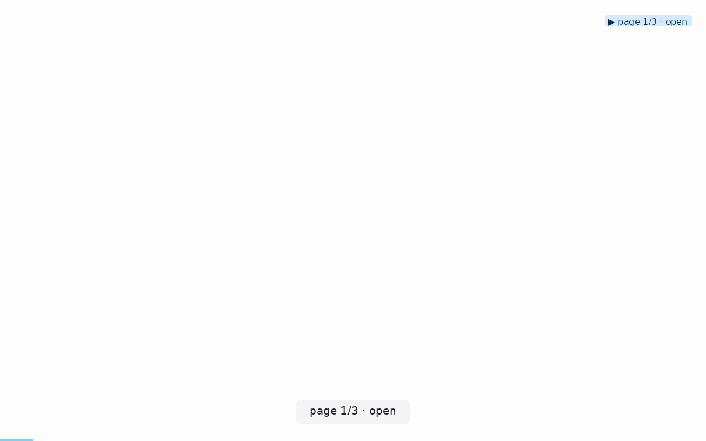

# 🎞️ clickcast

> Give AI agents visual + structured feedback about live web UIs — and give humans deterministic demo reels while you're at it.

[](https://pypi.org/project/clickcast/)
[](https://pypi.org/project/clickcast/)
[](https://github.com/AlexKay28/clickcast/actions)
[](./LICENSE)

> **What's new** — see [`CHANGELOG.md`](CHANGELOG.md) for the latest release notes.



> **See [`docs/ONE_PAGE_NAVIGATION_ORDER_TIPS.md`](docs/ONE_PAGE_NAVIGATION_ORDER_TIPS.md)** for the nine principles behind why this reel reads as legibly as it does — and the scenario template you can copy for your own reels.

> **Not to be confused with [vercel-labs/webreel](https://github.com/vercel-labs/webreel)** — that's a TypeScript tool for authoring polished demo videos. `clickcast` is a Python tool aimed primarily at *AI agents* that need a visual modality onto a live web UI, and secondarily at humans who want reproducible demo reels.

`clickcast` drives a real browser through a website and hands back **two things**:

1. A watchable **reel** — GIF / MP4 / WebP / raw frames.
2. A machine-readable **JSON sidecar** — every step's selector, timings, per-step frame paths, discovered elements, and post-action page state (title, URL, console errors, failed requests). Versioned. See [`docs/feedback-schema.md`](docs/feedback-schema.md).

Point it at a URL and it will *auto-discover* the interactive elements and build a tour for you, or hand it a small YAML **scenario** for a scripted, repeatable walkthrough.

---

## Install

```bash
pip install clickcast                 # requires Python ≥ 3.10
clickcast install                     # download chromium (~one-time, ~180 MB)
clickcast doctor                      # verify environment
```

On Linux CI you'll need the system libs Chromium depends on:

```bash
clickcast install --with-deps chromium
```

---

## For AI agents — copy this prompt into your chat

Paste the block below into your coding agent (Claude Code, Cursor, Copilot Chat, Codex, etc.) to teach it clickcast in one message. The agent will install the tool, verify the environment, generate a visual + machine-readable report for your project, and know how to gate CI on the results.

```text
You are going to use `clickcast` (https://pypi.org/project/clickcast/) to visually verify
this project's frontend. It produces a watchable GIF reel + a JSON sidecar with
per-step selectors, timings, page state, error codes, and a graph of the app's
pages. Follow this exact sequence:

1. INSTALL
   pip install clickcast
   clickcast install --with-deps chromium   # first time only, ~180 MB
   clickcast doctor                          # bail out if this fails

2. LOAD FULL CAPABILITIES
   Run `clickcast skill --json` and read the output. It lists every subcommand,
   flag, docs URL, and sidecar schema pointer. Prefer this over guessing.

3. RUN A QUICK TOUR OF THE APP
   If we have a running URL (dev server / staging / production):
     clickcast auto <URL> --for-humans --emit-events --out tour.gif
   If we have a specific flow to verify, write a YAML scenario and run:
     clickcast run tour.yml --emit-events --out tour.gif
   `--for-humans` gives a legible reel for the user to watch;
   `--emit-events` prints a machine-readable JSONL line you can parse.

4. READ THE SIDECAR (JSON at `<gif>.json`, schema v3)
   For each step, gate on the structured fields — NOT regex over prose:
     - `status`      : "ok" | "failed" | "skipped"
     - `error_code`  : "timeout" | "locator_missing" | "cross_origin" |
                       "navigation_error" | "selector_ambiguous" | "other"
     - `skip_reason` : "optional_no_reaction" | "pre_action_failed" |
                       "element_vanished" | "cross_origin_bounce"
     - `page_state`  : title, url_after, console_errors, page_errors,
                       network_failed
   The top-level `graph` block gives page nodes + navigation edges you can
   use to reason about the app's shape, not just the sequence you ran.

5. WATCH STDERR FOR ADVISORIES
   clickcast prints `⚠ <message> — see <docs-url>` lines for known anti-
   patterns (nav-heavy tour, click without DOM reaction, very short reel,
   cross-origin bounce, incoherent cursor styling). Each has a stable
   kebab-case id you can dedupe or gate on.

6. FOR CI REGRESSION GATES
   `clickcast assertions <sidecar>.json --baseline golden.json` diffs the
   run against a committed baseline; nonzero exit on drift. Byte-identical
   across runs (timestamps, frame paths, and URL query strings excluded).

Reference docs (all in-repo, load lazily as needed):
  - Sidecar shape:   https://github.com/AlexKay28/clickcast/blob/main/docs/feedback-schema.md
  - Human-legible reel authoring: https://github.com/AlexKay28/clickcast/blob/main/docs/ONE_PAGE_NAVIGATION_ORDER_TIPS.md
  - Agent integration:  https://github.com/AlexKay28/clickcast/blob/main/docs/ai-integration.md

If something is unclear, run `clickcast <subcommand> --help` before asking me.
```

Once the agent has this, ask it something concrete like *"run clickcast auto against `http://localhost:3000` and tell me which clicks had DOM reactions"* — it now has everything it needs.

---

## First run — 30 seconds

```bash
clickcast auto https://example.com --out tour.gif
```

Produces two files:

- `tour.gif` — the reel
- `tour.gif.json` — the AI-consumable sidecar (`schema_version: 1`, spec at [`docs/feedback-schema.md`](docs/feedback-schema.md))

For a walkthrough of how an LLM agent consumes both, see [`docs/ai-integration.md`](docs/ai-integration.md).

---

## Three modes

| Mode | Command | When |
|---|---|---|
| **Auto** | `clickcast auto <url>` | Quick tour of a site; you don't care about the exact script. |
| **Scenario** | `clickcast run tour.yml` | Precise, repeatable walkthrough. Docs, release notes, CI. |
| **Shot** | `clickcast shot <url>` | One screenshot, viewport or full-page. |

All three are deterministic, headless-by-default, and CI-friendly.

---

## Commands

### `auto <url>`

Discover interactive elements and record a click-tour.

| Flag | Default | Notes |
|---|---|---|
| `--out PATH` | `reel.gif` | Extension picks the format. |
| `--max-steps N` / `-N` | `10` | Cap on discovered elements to click. |
| `--dwell SEC` | `1.0` | Hold time after each action. |
| `--initial-wait SEC` | `2.0` | Post-`networkidle` hold to let SPAs hydrate. |
| `--viewport WxH` | `1280x800` | |
| `--device NAME` | – | Playwright preset (e.g. `"iPhone 15"`, `"Pixel 8"`). |
| `--engine E` | `chromium` | `chromium` / `firefox` / `webkit`. |
| `--headful` | off | Show a real browser window. |
| `--lang LOCALE` | – | e.g. `en-US`. |
| `--dark` | off | Emulate `prefers-color-scheme: dark`. |
| `--fps N` | `12` | |
| `--format F` | – | Override extension-derived format. |
| `--quality 1..30` | `8` | Lower = better (higher fidelity, bigger file). |
| `--loop N` | `0` | `0` = infinite. |
| `--no-sidecar` | off | Skip the JSON. |
| `-v` / `--verbose` | – | Repeatable. |

### `run <scenario.yml>`

Execute a YAML scenario. See [Scenario format](#scenario-format).

```bash
clickcast run docs/scenarios/spa.yml \
    --out release-notes.mp4 --format mp4 \
    --var base_url=https://staging.example.com
```

Flags: `--out`, `--format`, `--headful`, `--slowmo MS`, `--url URL` (retarget the first `goto` step — see below), `--var key=value` (repeatable — substitute `{{ key }}` inside the scenario), `--no-sidecar`.

CLI flags override the scenario's `meta:` block.

**Point an existing scenario at a different environment** with `--url` — no YAML edits, no `{{ URL }}` templating:

```bash
clickcast run tour.yml --url https://staging.example.com/app
```

`--url` rewrites the first `goto` step's URL and wins over `--var URL=...`. Only the first `goto` is touched — later `goto` steps are usually intra-app navigation from the entry point, so they stay put.

### `shot <url>`

Single screenshot.

```bash
clickcast shot https://example.com --full-page --out home.png
```

Flags: `--out`, `--full-page`, `--wait` (`load` / `domcontentloaded` / `networkidle` / a selector / a number of seconds), `--viewport`, `--device`, `--engine`, `--dark`.

### `init [path]`

Scaffold a starter YAML scenario. `--from-auto` runs discovery once and seeds the file with the top-scoring click steps.

```bash
clickcast init tour.yml --url https://example.com --from-auto
```

Flags: `--url`, `--name`, `--out`, `--from-auto`, `--force`.

### `elements <url>`

Dump the discovered interactive elements — useful for authoring selectors.

```bash
clickcast elements https://example.com --json > elements.json
```

Flags: `--limit`, `--json`, `--viewport`, `--engine`.

### `doctor`

Check Python version, playwright, engine binaries, ffmpeg, config path.

```bash
clickcast doctor           # human-readable
clickcast doctor --json    # machine-readable, non-zero exit on failure
```

### `config`

Read / write persistent defaults.

```bash
clickcast config path                    # print the user config file path
clickcast config list                    # every effective value + source
clickcast config get engine
clickcast config set engine firefox
```

Set values land in the user TOML at `clickcast config path`. See [Configuration](#configuration) for precedence.

### `install [engines…]`

Wrapper over `playwright install`. Default engine: `chromium`.

```bash
clickcast install                        # chromium only
clickcast install firefox webkit         # add more
clickcast install --with-deps chromium   # Linux: pull system libs (needs sudo)
```

---

## Scenario format

A scenario is plain YAML: a `meta:` block and a list of `steps:`. Full worked examples: [`docs/scenarios/`](docs/scenarios/).

```yaml
meta:
  name: WorldSight broad tour
  engine: chromium              # chromium | firefox | webkit
  viewport: 1280x800
  device: null                  # or "iPhone 15", "Pixel 8", "iPad Pro"
  fps: 12
  dwell: 1.0                    # default seconds after each step
  format: gif                   # gif | mp4 | webp | frames
  out: worldsight.gif

steps:
  - goto: https://worldsight-weld.vercel.app
    wait: networkidle
    label: Open WorldSight

  - click: "text=3D"
    label: Switch to 3D globe
    dwell: 2.0

  - hover: "[aria-label='Rankings']"
  - click: "[aria-label='Rankings']"
    label: Open Rankings

  - type:
      into: "#search"
      text: "Japan"
    label: Search Japan

  - select:
      in: "#metric"
      value: "GDP"

  - scroll:
      to: footer
```

### Supported actions

| Action | Example | Notes |
|---|---|---|
| `goto` | `goto: https://…` | Navigate. Pair with `wait`. |
| `click` | `click: "text=Compare"` | CSS, `text=…`, or `role=…` selectors — Playwright syntax. |
| `dblclick` | `dblclick: ".cell"` | |
| `hover` | `hover: ".menu"` | Reveals CSS `:hover` state. |
| `type` | `type: { into: "#q", text: "Japan", delay: 40 }` | `delay` is per-char ms. |
| `press` | `press: "Enter"` | Or `press: { key: "Ctrl+A", selector: "#in" }`. |
| `select` | `select: { in: "#m", value: "GDP" }` | `in:` in YAML → `into` internally. |
| `scroll` | `scroll: { to: "footer" }` or `scroll: { by: 600 }` | Element or pixel scroll. |
| `wait` | `wait: 1.5` or `wait: networkidle` or `wait: ".map-loaded"` | Number = seconds, string = load-state or selector. |
| `screenshot` | `screenshot: { full_page: true }` | Force a frame capture. |

Every step also accepts `label`, `dwell`, `optional: true` (don't fail the run if the selector is missing — sidecar records `status: "skipped"`), and `repeat: N`.

Variable substitution: `{{ key }}` inside any string, injected via `--var key=value`.

---

## Python API

Fluent, chainable — every builder returns `self`:

```python
from clickcast import Reel

reel_path = (
    Reel("https://worldsight-weld.vercel.app", viewport=(1280, 800), fps=12)
    .goto(wait="networkidle")
    .click("text=3D", label="Switch to 3D globe", dwell=2.0)
    .click("[aria-label='Rankings']", label="Open Rankings")
    .scroll(to="footer")
    .save("worldsight.gif")  # or .save("tour.mp4", quality=8)
)
```

Async variant for callers already inside a running event loop:

```python
from clickcast import AsyncReel

reel = AsyncReel("https://example.com").goto(wait="networkidle").click("#cta")
path = await reel.save("tour.gif")
```

Discovery only, no reel:

```python
from clickcast import discover

elements = discover("https://example.com", limit=10)
```

Skip the sidecar with `save(..., no_sidecar=True)`.

---

## Pre-push iteration on a local static build

Building a static site and reeling it locally before pushing? Use `Reel.serve_dir` (or the standalone `serve_directory` helper) as a context manager — it starts a threaded HTTP server on a free port, yields the base URL, and tears the server down on exit. No more `python3 -m http.server 8091 &` invocations that leak past your shell session and collide with the next iteration.

```python
from clickcast import Reel

with Reel.serve_dir("./public") as url:
    Reel(url).goto().click(".chip").save("out.gif")
# Server is gone; the port is free.
```

Defaults are safe for dev iteration: loopback-only bind (`127.0.0.1`), OS-picked free port, `ThreadingHTTPServer` so parallel browser requests don't queue. Override any of them explicitly:

```python
from clickcast.serving import serve_directory  # importable without going through Reel

with serve_directory("./dist", port=8091, bind="0.0.0.0", threading=False) as url:
    ...
```

`bind="0.0.0.0"` exposes the server to your LAN — opt-in, not the default.

---

## Reading the sidecar

Every recording run writes `<out>.json` alongside the media file.

```python
from clickcast.feedback import load

report = load("tour.gif.json")

for step in report.steps:
    if step.status == "failed":
        print(f"step {step.index} ({step.action}) failed: {step.error}")
        print("  frames:", step.frames)
        if step.page_state:
            print("  console errors:", step.page_state.console_errors)
```

Consumers that don't want to import `clickcast` can parse the JSON directly against the schema at [`src/clickcast/feedback/schema/v1.json`](src/clickcast/feedback/schema/v1.json). A standalone reference implementation lives at [`tests/consumer/read_sidecar.py`](tests/consumer/read_sidecar.py).

See [`docs/ai-integration.md`](docs/ai-integration.md) for the two-line agent-integration example and [`docs/feedback-schema.md`](docs/feedback-schema.md) for the full field-by-field walkthrough.

---

## CI: 2-line regression gate

Every reel writes a JSON sidecar, but raw sidecars carry timestamps, frame
filenames, and query-string tokens — none of which are stable across runs.
For a proper CI regression gate, use `clickcast assertions` (or
`Reel.assertions()`) to distill the sidecar down to the shape that
actually matters: step count, per-step action / label / status, and the
per-step error counters.

The distilled shape is byte-identical across runs of the same scenario
against the same URL (schema: [`docs/assertions-schema/v1.json`](docs/assertions-schema/v1.json)).
Diff it against a committed baseline; non-zero exit on drift.

**Bootstrap the baseline once:**

```bash
clickcast run tour.yml --out reel.gif
clickcast assertions reel.gif.json > tests/golden-tour.json  # commit this
```

**Then in CI (2 lines):**

```bash
clickcast run tour.yml --out reel.gif
clickcast assertions reel.gif.json --baseline tests/golden-tour.json
```

Exit 0 means the target UI produced the same step ordering, statuses, and
error-signal counts as when the baseline was captured; anything else is
real drift and the command prints per-line descriptions like
`step 2: status changed 'ok' -> 'failed'`.

Same signal from Python:

```python
from clickcast import Reel

reel = Reel(url).goto().click(".cta").save("reel.gif")
drift, is_clean = reel.assertions_diff("tests/golden-tour.json")
if not is_clean:
    raise SystemExit("\n".join(drift))
```

Excluded from the distilled shape on purpose: wall-clock timestamps,
per-step `duration_ms`, `frames` filenames, resolved URLs (including
query-string tokens), `cursor_xy`. If you need those in your gate too,
diff the raw sidecar with your own tooling — the assertion set is the
narrow "did the UI still behave" contract, not the wire-level snapshot.

---

## Configuration

Precedence (highest → lowest):

1. CLI flags
2. Scenario `meta:` block
3. `CLICKCAST_*` environment variables
4. Project `./clickcast.toml`
5. User TOML (path via `clickcast config path`)
6. Built-in defaults

Every `Config` field can be set at any of these layers: `engine`, `viewport`, `device`, `headful`, `slowmo`, `lang`, `dark`, `proxy`, `fps`, `dwell`, `format`, `quality`, `loop`.

Project TOML — flat or `[defaults]`-wrapped both work:

```toml
# clickcast.toml
engine   = "chromium"
viewport = "1280x800"
fps      = 12
dwell    = 1.0
format   = "gif"
```

Env vars:

```bash
CLICKCAST_ENGINE=firefox
CLICKCAST_VIEWPORT=1440x900
CLICKCAST_HEADFUL=true
CLICKCAST_PROXY=http://proxy.internal:8080
```

---

## Output formats

| Format | Best for | Notes |
|---|---|---|
| `gif` | READMEs, chat, quick shares | Widest compatibility; larger files. |
| `mp4` | Docs sites, social, long tours | Smallest for length; uses `imageio-ffmpeg`'s bundled binary. |
| `webp` | Web embedding | Great size/quality; animated. |
| `frames` | Custom pipelines | Numbered PNGs + a `frames.json` manifest. |

`--quality 1..30` trades size for fidelity (lower = better). `--loop 0` loops forever; `--loop 1` plays once.

---

## How it works

```
   URL ─▶ Session ─▶ Actions ─▶ Recorder ─▶ Encoder ─▶ .gif/.mp4/.webp
        (chromium)  (auto or   (per-step   (Pillow /
                     YAML)      PNGs +      imageio-
                                manifest)   ffmpeg)
                        │           │
                        ▼           ▼
              PageStateCollector    ─▶ ReportBuilder ─▶ <out>.json
                (console errors,
                 page errors,
                 failed requests)
```

1. **Session** launches a Playwright browser at the requested viewport/device.
2. **Actions** run one step at a time (`click`, `type`, `scroll`, …) with normalised timings and cursor tracking.
3. **Recorder** captures a pre-frame + N padding frames per step (deterministic filenames, byte-identical copies for padding).
4. **PageStateCollector** subscribes to page events for the sidecar.
5. **Encoder** produces the final artifact; **ReportBuilder** finalises the JSON.

The annotator (`clickcast.annotate.Annotator` — click ripples, cursor trail, caption bar, progress bar) ships as a library API in v0.1. Automatic wiring into `auto` / `run` outputs is planned for v0.2 (see [Roadmap](#roadmap)).

---

## Troubleshooting

- **Blank frames** — the site is a SPA; increase `--initial-wait`, or add `wait: networkidle` (or a specific selector) to the first step.
- **`ffmpeg not found`** — `imageio-ffmpeg` bundles a static binary; falls back if missing. Choose `gif` / `webp` if you'd rather skip MP4 entirely.
- **Selector not found** — `clickcast elements <url>` shows what's actually clickable. Or mark the step `optional: true`.
- **Can't reach an internal site** — set `CLICKCAST_PROXY`, or `proxy` in the scenario `meta:` block.
- **Chromium missing** — `clickcast install`. On Linux CI add `--with-deps`.
- **Sidecar shape changed** — the current schema is versioned at `src/clickcast/feedback/schema/v1.json`; a future v2 (see [#29](https://github.com/AlexKay28/clickcast/issues/29)) will add a `graph` block without breaking v1 consumers.

---

## Contributing

```bash
git clone https://github.com/AlexKay28/clickcast
cd clickcast
pip install -e ".[dev]"
clickcast install
```

Before opening a PR:

```bash
ruff check .
ruff format --check .
mypy
pytest -m "not integration"      # fast; ~2s
pytest                            # full; needs chromium
```

Cutting a release is documented in [`RELEASING.md`](RELEASING.md).

---

## Roadmap

**v0.1** (this release): Session · Actions · Recorder · Encoder · Discovery · YAML scenarios · CLI · Python API · Sidecar (schema v1) · Config precedence · Fixture test site · Docs.

**v0.2** (planned — tracked in [#29](https://github.com/AlexKay28/clickcast/issues/29)):

- On-frame HUD — fixed header/footer with step index, action verb, target role, URL. OCR-legible so LLMs can *read* the reel as a strip of images.
- BFS UI exploration — `clickcast explore <url>` treats the app as a state graph: discover → click → discover the new state → recurse. Bounded, deterministic, with visited-state dedup.
- Sidecar schema v2 — adds a top-level `graph` block (nodes = distinct page states, edges = `(from, to, action, transition_kind)`).
- Automatic annotation of `auto` / `run` outputs.

---

## License

MIT © 2026 Alex Kay. See [LICENSE](./LICENSE).
