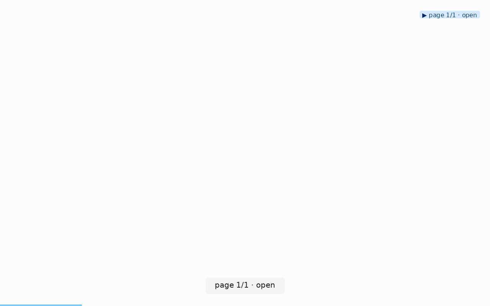
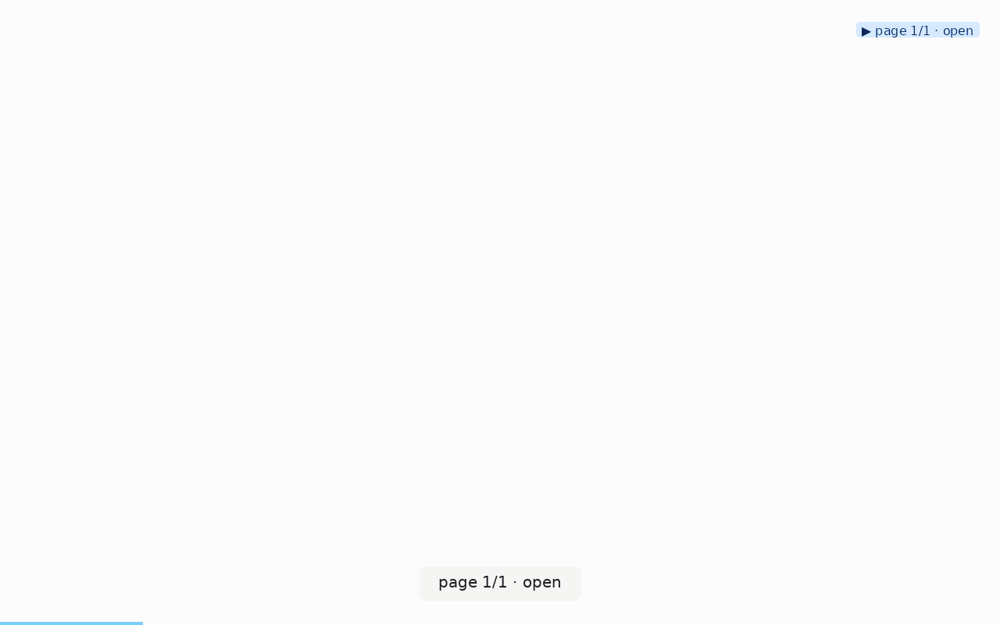

# a-b-comparison

**When to use:** you have two variants of a page (feature flag, A/B test,
before/after refactor) and want to compare their behavior side-by-side.

## Command

Run the same scenario twice, once per variant:

```bash
clickcast auto https://app.example.com/?variant=control \
  --max-pages 3 --max-steps 15 --dwell 0.3 \
  --out control.gif

clickcast auto https://app.example.com/?variant=treatment \
  --max-pages 3 --max-steps 15 --dwell 0.3 \
  --out treatment.gif
```

Or with `--seed-url` for a deterministic path in both:

```bash
for variant in control treatment; do
  clickcast auto https://app.example.com/?variant=$variant \
    --seed-url https://app.example.com/checkout?variant=$variant \
    --seed-url https://app.example.com/confirmation?variant=$variant \
    --out $variant.gif
done
```

## Reels

Side-by-side (control | treatment):

 

## The 1-line gate: `clickcast assertions`

Since v0.2.0, `clickcast assertions` is the built-in A/B differ. Point
it at both sidecars — control as the baseline, treatment as the candidate
— and it prints a stable diff (no timestamps, no wall-clock durations, no
frame filenames) so any output line is a real behavioral delta:

```bash
clickcast assertions treatment.gif.json --baseline control.gif.json
# exit 0 → variants match on every stable field
# exit 1 → prints e.g. "step 3: status changed ok → failed",
#          "step 4: console_error_count 0 → 2"
```

Wire that into CI as the pass/fail gate for the treatment variant.

## Reducing noise between runs

A/B comparisons are only as good as the runs' determinism. Two v0.2.0
additions cut noise:

- `wait_for(selector, state='stable')` scenario step — replaces the
  `--dwell N` guessing. Waits until the target element's bounding box
  hasn't moved for `quiet_ms`. When both variants use it, animation
  timing differences stop showing up as spurious `duration_ms` deltas.
- `goto(retries=N)` — a transient cold-serverless timeout on one variant
  no longer looks like a regression.

## What else to compare

Beyond the assertions diff, the raw sidecar carries fields that don't
survive the "stable" filter but are worth eyeballing manually:

```bash
# Compare page-load / step timings between variants (noisy but useful trend):
diff \
  <(jq '.steps[] | {step: .step_index, action, ms: .duration_ms}' control.gif.json) \
  <(jq '.steps[] | {step: .step_index, action, ms: .duration_ms}' treatment.gif.json)
```

- `discovered_elements` — did the treatment surface add new interactive
  elements? Remove old ones?
- `page_state.console_errors` — did one variant introduce new JS errors?
  (Counted by `assertions` diff; contents visible here.)
- `page_state.network_failed` — did one variant break an API call?
  (Same.)

## Compositing the two reels

If you want a single side-by-side GIF for a report:

```bash
# imagemagick approach:
convert control.gif treatment.gif +append side-by-side.gif

# ffmpeg (better GIF quality):
ffmpeg -i control.gif -i treatment.gif \
  -filter_complex "[0:v][1:v]hstack=inputs=2" \
  side-by-side.gif
```

## Why clickcast for A/B testing at all?

Because the sidecar is a structured record of what the browser did in each
variant — much cleaner input to reason about than raw HAR files or screen
recordings. An LLM asked "did the treatment variant hurt the checkout flow?"
can point to specific `duration_ms` deltas per step, not just wave at
"looks slower."
