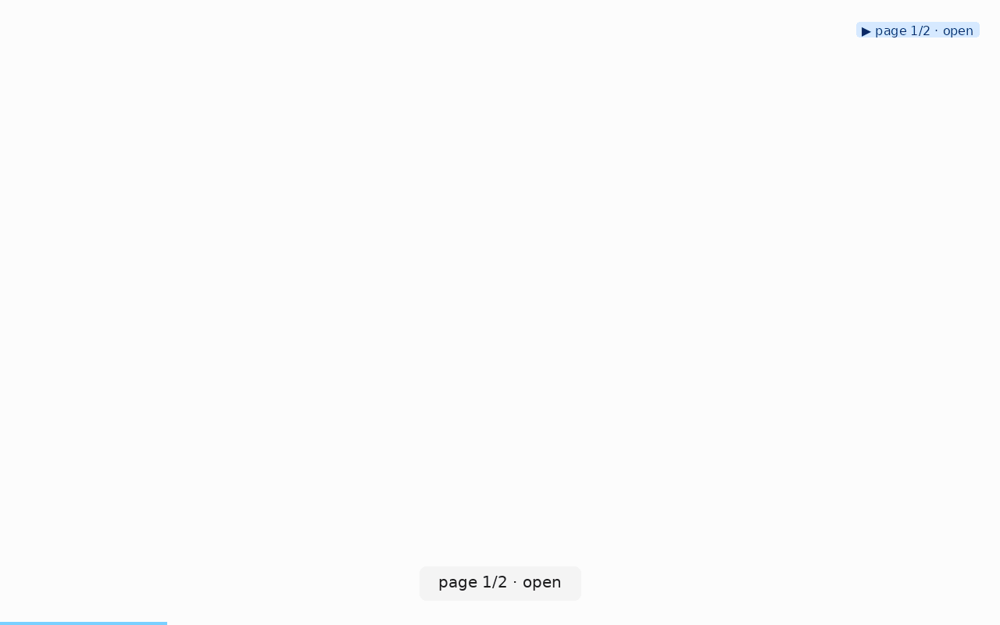

# accessibility-preflight

**When to use:** you want a quick "does this page have obvious ARIA /
accessible-name issues?" report before running a full axe-core / pa11y
audit. The sidecar's `discovered` list is the raw material.

## Command

```bash
clickcast auto https://your-site.example.com/ \
  --max-pages 3 \
  --max-steps 20 \
  --dwell 0.3 \
  --out a11y.gif \
  --verbose
```

## Reel



## The check: interactive elements with empty accessible names

Elements that got picked up as interactive but have no readable name are
the biggest accessibility red flag — a screen reader sees "button" with no
context.

```bash
jq -r '.discovered[]
       | select(.text == "" or .text == null)
       | "empty-name: \(.role) — \(.selector)"' a11y.gif.json
```

Sample output:

```
empty-name: button — role=button[name=""]
empty-name: link — role=link[name=""]
empty-name: link — role=link[name=""]
```

Each one is a candidate for an `aria-label` fix.

## Extension: elements in the footer / aria-hidden

clickcast's discovery already scores these down (`inFooter`, `ariaHidden`
penalties in `_score`). But if you want to surface them explicitly:

```bash
# Elements with low scores that are still in the reachable interactive set:
jq '.discovered | map(select(.score <= 0)) | length' a11y.gif.json
```

## Not a replacement for axe-core

This is a **preflight** — 60-second smoke test before running a proper
accessibility audit. axe-core catches contrast issues, focus order, ARIA
misuse, keyboard traps. `clickcast` only surfaces "which visible
interactive elements would a keyboard user reach, and which of those have
no accessible name." Complement, not substitute.

## Combine with an LLM

Feed the sidecar's `discovered` list + the reel to a model:

> "Look at the reel and the interactive elements list. Are any of these
> clearly missing an accessible name that a screen reader user would need?
> Cite the selector for each."

Models are surprisingly good at spotting "this is clearly a search icon
but the sidecar shows `text: ''` — needs `aria-label`."
