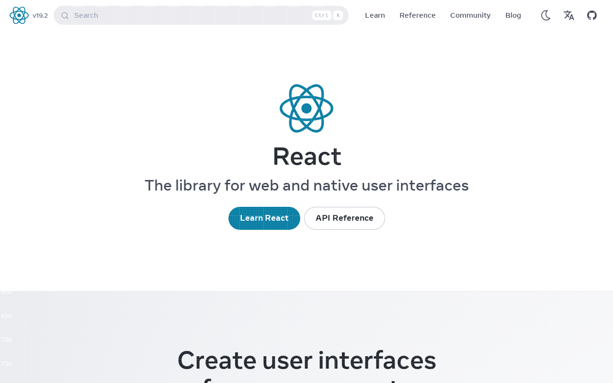

# accessible-element-targeting

**When to use:** an agent that already knows *what* it wants to click ("the
dark-mode toggle") needs to turn that into *where to click* and *is it safe
to click*. `elements --json --grid` fuses accessibility semantics (role,
accessible name, interactive state) with the pixel-grid overlay's coordinate
system for every discovered element — one call instead of stitching together
a separate accessibility-tree query and a screenshot.

This is different from [`../accessibility-preflight/`](../accessibility-preflight/),
which is an *audit* — finding elements with missing accessible names. This
is *targeting* — given an element you already care about, get everything
needed to act on it correctly.

## Command

```bash
clickcast elements https://react.dev/ \
  --grid --grid-pitch 50 \
  --limit 8 \
  --json > elements.json

clickcast shot https://react.dev/ \
  --grid --grid-pitch 50 \
  --out shot.png
```

Same `--grid-pitch` on both calls so the JSON's `grid_cell` values and the
screenshot's visible gridlines line up — cross-reference one against the
other below.

## Screenshot



## One element, end to end

From [`elements.json`](elements.json) — the "Use Dark Mode" toggle button:

```json
{
  "selector": "role=button[name=\"Use Dark Mode\"]",
  "role": "button",
  "text": "Use Dark Mode",
  "bbox": [1116, 8, 48, 48],
  "accessibility": {
    "role": "button",
    "name": "Use Dark Mode",
    "state": {
      "disabled": null,
      "checked": null,
      "expanded": null,
      "pressed": null,
      "selected": null
    },
    "grid_cell": [22, 0]
  }
}
```

What an agent does with each field:

- **`role` + `name`** — confirms this is the element the agent meant
  ("button" named "Use Dark Mode"), not a same-looking decoy.
- **`state`** — every field `null` here means Playwright couldn't positively
  confirm any ARIA state for this element (a real API limitation, not "false"
  — see [`docs/feedback-schema.md`](../../docs/feedback-schema.md)). A
  `disabled: true` would tell the agent not to bother clicking at all;
  `pressed`/`expanded`/`checked` tell it the toggle's current state before
  acting.
- **`grid_cell`** — `[22, 0]` locates the element on the coordinate system
  the paired screenshot was rendered with, `null` unless `--grid` was passed
  (matching how the grid overlay itself is opt-in).
- **`selector`** — the actual Playwright locator, for when the agent is
  driving a live session (e.g. via [`../live-mcp-session/`](../live-mcp-session/))
  rather than just reading a report.

## Related workflows

- **[`../spatial-grid-overlay/`](../spatial-grid-overlay/)** — the grid
  overlay on its own, across a full multi-step tour.
- **[`../accessibility-preflight/`](../accessibility-preflight/)** — the
  audit angle: which elements have *no* accessible name at all.
- **[`../live-mcp-session/`](../live-mcp-session/)** — an agent driving a
  live session can call `elements`-equivalent discovery mid-session, then
  act on exactly this shape of payload immediately.
