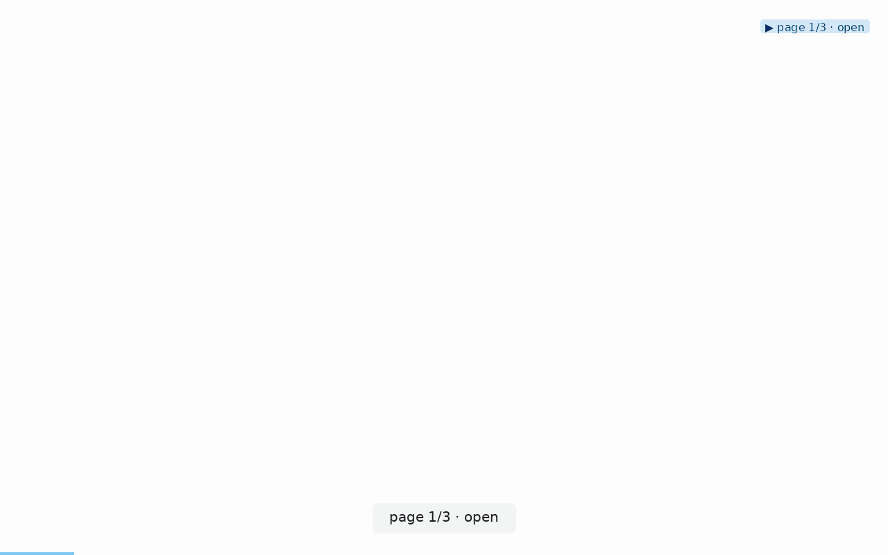

# ai-eye-review

**When to use:** you want an LLM to review a live UI — spot bugs, UX issues,
dead links, missing feedback. Feed it the reel + sidecar; the reel gives
visual context, the sidecar gives structured facts.

## Command

The reel below was generated against react.dev with:

```bash
clickcast auto https://react.dev/ \
  --pace slow \
  --max-pages 2 \
  --max-steps 8 \
  --initial-wait 3 \
  --click-timeout 15 \
  --zoom-on-click 2.5 \
  --traversal dfs \
  --out review.gif
```

Point it at your own site the same way (drop `--zoom-on-click` if you
prefer a flat view). Produces:

- `review.gif` — annotated reel with cursor arrows, actions panel, click
  ripples, zoom-on-click closeups, and progress bar (all overlays are
  default-on since v0.2.0 except zoom, which is opt-in).
- `review.gif.json` — the sidecar (schema at
  [`docs/feedback-schema.md`](../../docs/feedback-schema.md)).

## Reel



## Feed to an LLM

Attach both files to the model. Prompt shape:

```
Here's a visual tour (reel) and structured tour log (sidecar) of a live
web app. Please review it as a QA engineer would.

Focus on:
- UX friction: dead-end clicks, unclear affordances, missing feedback.
- Bugs: console_errors or network_failed entries in any step.
- Missing accessibility: interactive elements with empty accessible names.
- Coverage gaps: what important UI wasn't reached that should have been.

For each issue, cite the specific step_index and quote the sidecar field
that supports the finding.
```

## What the sidecar carries

The parts that matter for AI-eye review, from `review.gif.json`:

```json
{
  "schema_version": 1,
  "url": "https://your-site.example.com/",
  "media": {
    "path": "review.gif",
    "frame_count": 264,
    "duration_s": 22.0
  },
  "discovered_elements": [
    {"selector": "role=link[name=\"Docs\"]", "text": "Docs", "role": "link"},
    {"selector": "role=button[name=\"Sign in\"]", "text": "Sign in", "role": "button"}
  ],
  "steps": [
    {
      "step_index": 3,
      "action": "click",
      "selector": "role=link[name=\"Docs\"]",
      "status": "ok",
      "duration_ms": 143.0,
      "page_state": {
        "title": "Docs — example",
        "url_after": "https://your-site.example.com/docs",
        "console_errors": [],
        "network_failed": []
      }
    }
  ]
}
```

`page_state.console_errors` and `network_failed` are the highest-signal
fields for finding real bugs. `discovered_elements[*].text == ""` flags
accessibility issues.

## Related workflows

Once the LLM finds something worth filing:

- **`clickcast report-bug review.gif.json`** — turns the sidecar into a
  prefilled GitHub issue with the environment, failed step, and sidecar
  excerpt already populated. See [`../bug-report/`](../bug-report/).
- **`clickcast skill`** — prints a single self-contained brief covering
  every clickcast command; hand it to the LLM at the start of a session
  so it knows what the tool can do.
- **`clickcast assertions review.gif.json --baseline golden.json`** —
  turns a review into a CI regression gate. See
  [`../regression-visual-diff/`](../regression-visual-diff/).

## Why DFS

DFS gives a coherent narrative — the reel reads like a user journey (Home →
Docs → Docs/Getting-Started → …) rather than jumping between unrelated
top-level pages. Related pages sit adjacent in the sidecar's `steps` array,
which makes the model's job easier: "what happened in the Docs section?"
becomes a contiguous slice.
