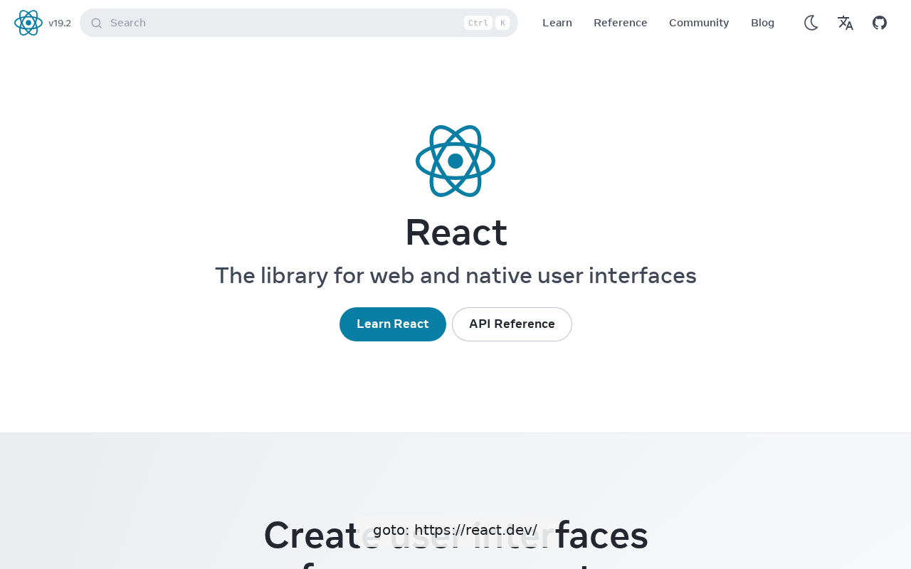

# live-mcp-session

**When to use:** every other demo in this folder is `auto` or `run` — record
the whole thing, then look at the result. `clickcast mcp` is the opposite:
an agent drives the browser one action at a time over MCP, reacting to what
it sees before deciding the next call. This demo proves it produces the
same *kind* of visual artifact a batch tour does, despite being fundamentally
interactive — the reel below is assembled from the literal frames the live
session returned, not a re-recording.

See [`docs/mcp.md`](../../docs/mcp.md) for the full "what is this, when do I
reach for it" writeup, and
[`docs/mcp-tool-schema.md`](../../docs/mcp-tool-schema.md) for every tool's
exact args/return shape.

## The session

A real client (`mcp.shared.memory`'s in-process connector — the same
harness `tests/mcp/` uses, no subprocess needed for this demo) drove a real
Chromium session through four tool calls:

```python
from mcp.shared.memory import create_connected_server_and_client_session
from clickcast.mcp.server import create_server

server = create_server()
async with create_connected_server_and_client_session(server._mcp_server) as client:
    await client.call_tool("start_session", {"viewport": "1280x800"})
    await client.call_tool("goto", {"url": "https://react.dev/"})
    await client.call_tool("click", {"selector": 'role=link[name="Learn"]'})
    await client.call_tool("click", {"selector": 'role=link[name="Reference"]'})
    await client.call_tool("close_session", {"save_transcript": "transcript-sidecar.json"})
```

Each `goto`/`click` call returned an annotated PNG frame (cursor + click
ripple + label, same overlay pipeline `auto`/`run` use) plus a `page_state`
block, inline in the tool response — nothing was captured out-of-band.

## Reel



Assembled directly from the three frames `goto` and the two `click` calls
returned (`start_session`/`close_session` don't produce a frame — they're
lifecycle calls, not page actions).

## Full transcript

[`session.json`](session.json) — every call's args and full result payload,
including a genuine `page_state.network_failed` entry (a blocked analytics
beacon on the real page, not a fabricated example) from the `goto` call:

```json
{
  "call": "goto",
  "args": {"url": "https://react.dev/"},
  "result": {
    "status": "ok",
    "page_state": {
      "title": "React",
      "url_after": "https://react.dev/",
      "console_errors": [],
      "network_failed": ["https://region1.google-analytics.com/g/collect?..."]
    }
  }
}
```

Same `page_state` shape as the batch sidecar — an agent gating on
`console_errors`/`network_failed` doesn't need different logic for a live
session vs. a recorded one.

## The session IS a sidecar, too

`close_session`'s `save_transcript` argument flushed everything the session
did to [`transcript-sidecar.json`](transcript-sidecar.json) — a real,
schema-valid sidecar (`schema_version: 4`, three steps: `goto`, `click`,
`click`), indistinguishable in shape from what `clickcast run` would have
produced for the same three actions. A live MCP session isn't a second-class
citizen that only *looks* like a tour after the fact — it produces the exact
same downstream artifact.

## Related workflows

- **[`../ai-eye-review/`](../ai-eye-review/)** — the batch equivalent: same
  sidecar shape, same "feed it to an LLM" pattern, recorded up front instead
  of driven live.
- **[`../accessible-element-targeting/`](../accessible-element-targeting/)** —
  an agent driving a live session like this one would typically call
  discovery mid-session to decide *what* to click next, then act on it with
  exactly this `click` tool call.
