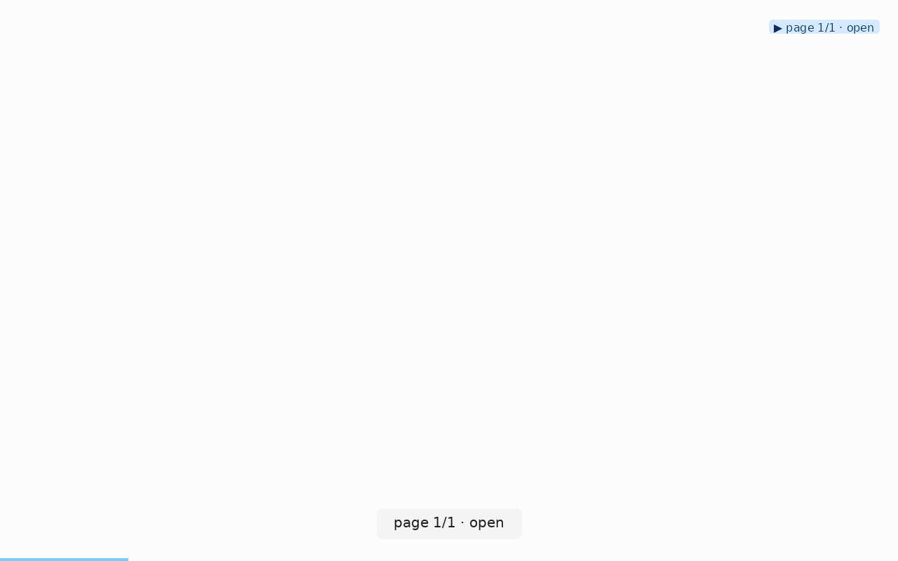

# llm-doc-scraping

**When to use:** you want to give an LLM structured knowledge about a
documentation page or feature reference — without fighting client-side
JS rendering, dynamic routing, or the pain of parsing HTML.

## Command

```bash
clickcast auto https://docs.example.com/pricing \
  --max-pages 1 \
  --max-steps 10 \
  --dwell 0.4 \
  --initial-wait 3 \
  --out pricing.gif \
  --verbose
```

Or for a whole docs section:

```bash
clickcast auto https://docs.example.com/api/ \
  --max-pages 8 \
  --max-steps 40 \
  --traversal bfs \
  --dwell 0.3 \
  --out api-docs.gif
```

## Reel



## Why not scrape HTML directly?

Three reasons:

1. **Client-side rendering.** Modern docs sites are often SPAs. Raw
   `curl` returns a shell with `<div id="root"></div>`. Playwright
   actually renders the JS.
2. **Interactive elements matter.** Toggle expandable sections, hover
   for tooltips, click "Show more" — HTML alone misses these.
3. **Semantic structure via `discovered_elements`.** clickcast's discovery
   collects role + accessible name for every interactive element. That
   gives the LLM a cleaner map of the page's affordances than raw DOM.

## Feed to the LLM

The sidecar's top-level `discovered_elements` array is the highest-signal
input. Snippet:

```json
{
  "discovered_elements": [
    {"role": "heading", "text": "API Reference"},
    {"role": "link", "text": "Authentication", "selector": "role=link[name=\"Authentication\"]"},
    {"role": "link", "text": "Rate limits", "selector": "role=link[name=\"Rate limits\"]"},
    {"role": "button", "text": "Copy code sample"}
  ]
}
```

Prompt shape:

```
Here is the interactive surface of a docs page (from clickcast's
discovery). Answer the user's question by citing the specific
`selector` and `text` values you'd use to navigate to the answer.
```

## Bonus: extract the tour's per-step targets as prose

`discovered_elements` is captured on the START page only. To surface what
was clicked and where the tour landed on subsequent pages, walk `steps`:

```bash
jq -r '.steps[] | select(.status == "ok") |
       "- **\(.action | ascii_upcase)** \(.label // .selector // .args.url // "") → \(.page_state.url_after // "-")"' \
   api-docs.gif.json
```

Produces one markdown line per successful step — easy to feed to a small
model or paste into a spec.

## Bonus 2: focused crop of a single doc section

`Reel.save_region('.api-parameters', 'api-parameters.png', frame=-1)`
grabs the exact bounding rect of a named selector from the last captured
frame — useful when you want to feed the LLM just one section of a long
docs page rather than the whole reel. See
[`../../src/clickcast/reel.py`](../../src/clickcast/reel.py) for the
signature (added in v0.2.0).
