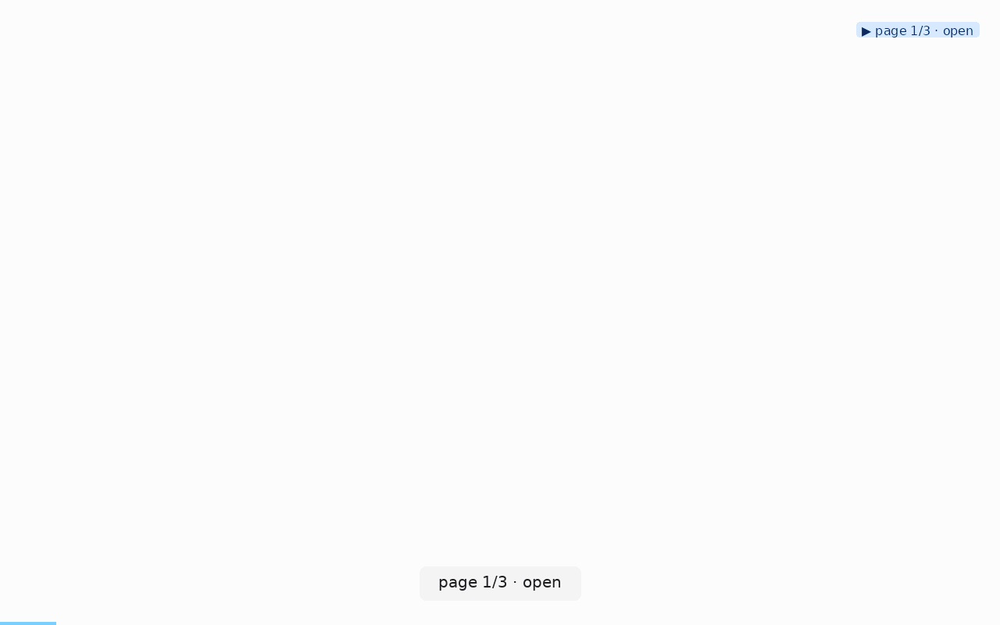

# onboarding-tutorial

**When to use:** you want a reel + sidecar of your product's first-time-user
flow, and you want the prose walkthrough to stay in sync with the reel
without hand-writing it.

## Command

Explicit path via `--seed-url` so the tour matches your onboarding script:

```bash
clickcast auto https://your-app.example.com/welcome \
  --seed-url https://your-app.example.com/tour/step-1 \
  --seed-url https://your-app.example.com/tour/step-2 \
  --seed-url https://your-app.example.com/tour/step-3 \
  --seed-url https://your-app.example.com/dashboard \
  --dwell 0.6 \
  --initial-wait 2 \
  --out onboarding.gif \
  --verbose
```

`--seed-url` is critical here: it guarantees the tour follows your intended
narrative rather than wandering through auto-discovered nav.

## Reel



The reel itself already narrates each step visually via the actions panel
(top-right, on by default since v0.2.0) — the highlighted row on any frame
tells the viewer exactly which step they're watching, so viewers reading
along don't need timestamps or captions.

## Auto-generate prose from the sidecar

Every step carries a `label` field (populated by `auto` from role + name,
by `run` from your scenario's `label:`). Extract it as a captioned list:

```bash
jq -r '.steps[] | "\(.step_index + 1). \(.label // (.action + " " + (.selector // .args.url // "")))"' \
   onboarding.gif.json
```

Produces markdown like:

```
1. page 1/5 · open
2. page 1/5 · click · Get started
3. page 2/5 · open
4. page 2/5 · click · Next
...
```

Paste into your docs. Every time the flow changes, re-run the tour → the
list regenerates. No drift between the reel and the text.

## Why not a hand-authored scenario YAML?

You can. `clickcast run tutorial.yml --url https://staging.example.com`
gives you finer control over dwell, labels, and click ordering. Use it
when the flow has non-obvious steps (dismiss a modal, wait for a specific
selector). Use `auto --seed-url` when the flow is "open these pages, click
whatever's on top" — cheaper to maintain.

The v0.2.0 `wait_for(selector, state='stable')` scenario step is
especially useful in scripted onboarding tours: no more `dwell: 3.0`
guessing before an animation settles.
