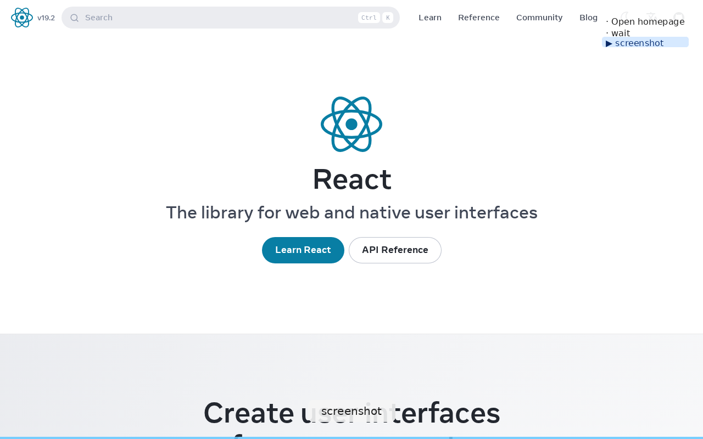
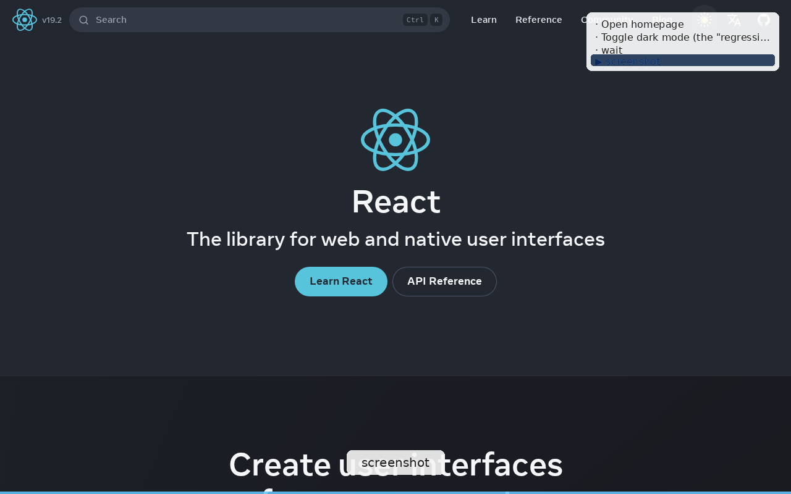
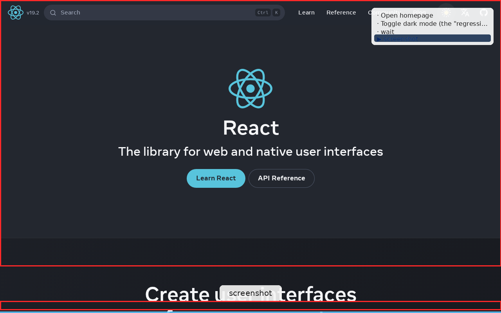

# pixel-visual-diff

**When to use:** [`../regression-visual-diff/`](../regression-visual-diff/)
(`clickcast assertions`) is *structural* — it answers "did the same steps
run with the same outcomes." It's blind to pixels: a button that silently
moved, or a color scheme that flipped, produces an identical structural
diff. `clickcast diff` is the companion for that gap — a real pixel-level
comparison between two runs, with the changed regions highlighted.

## Command

Two scenarios against the same real site: [`baseline.yml`](baseline.yml)
just opens the homepage; [`run.yml`](run.yml) does the same, then clicks
react.dev's own dark-mode toggle — a stand-in for "something changed the
site's appearance," the kind of regression structural diff can't catch.

```bash
clickcast run baseline.yml --format frames --out baseline.gif
clickcast run run.yml      --format frames --out run.gif

clickcast diff run.gif.json baseline.gif.json --out diff
```

`--format frames` is required — `diff` needs the real per-step PNGs on
disk, and a `gif`/`mp4`/`webp`-format run discards its frame buffer once
encoded. (Raw frame directories aren't committed here — regenerate them
with the commands above; only the derived stills and `diff/summary.json`
are checked in.)

## Before / after / diff

| Baseline (light) | Run (dark-mode toggled) | Diff (highlighted regions) |
|---|---|---|
|  |  |  |

## What actually happened

```
· step 0 (Open homepage): 0.00% changed
· step 2:                 81.32% changed, 2 region(s)
· step 3:                 81.32% changed, 2 region(s)
! run step 1 (Toggle dark mode (the "regression")): unmatched — no baseline counterpart
worst step: 81.32% changed
```

Two things worth noticing, both real behavior, not cherry-picked:

- **The regions are real.** [`diff/summary.json`](diff/summary.json)
  records two bounding boxes — a `1280×680` region covering almost the
  whole viewport (the color-scheme flip touches nearly everything) and a
  `1280×23` strip lower on the page. This is exactly what
  region-highlighted diffing is for: not just "something changed" but
  *where*.
- **The click step is correctly unmatched, not silently dropped.**
  `baseline.yml` and `run.yml` have different step counts (3 vs. 4) —
  `run.yml`'s dark-mode click has no counterpart in `baseline.yml` at all.
  Rather than mis-pairing it against the wrong baseline step,
  `clickcast diff` pairs by label where it can and flags the rest in
  `unmatched_steps` with a `reason`, per the pairing rules in
  [`src/clickcast/feedback/visual_diff.py`](../../src/clickcast/feedback/visual_diff.py)'s
  own design note.

## CI gate

`--fail-above 5` would exit non-zero here (81.32% ≫ 5%) — the same
contract [`../../.github/actions/clickcast/`](../../.github/actions/clickcast/)
builds its PR-comment gate on. Omit `--fail-above` (as above) to report
only, without failing the command.

## Related workflows

- **[`../regression-visual-diff/`](../regression-visual-diff/)** — the
  structural half of this pairing (`clickcast assertions`); use both
  together in CI.
- **[`docs/ci/README.md`](../../docs/ci/README.md)** — the packaged
  GitHub Action that runs `assertions` + `diff` and posts the result as a
  PR comment.
